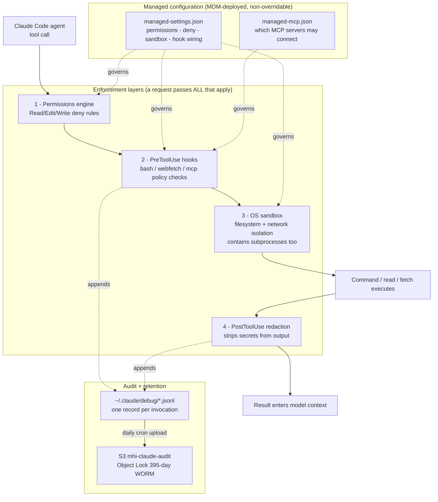
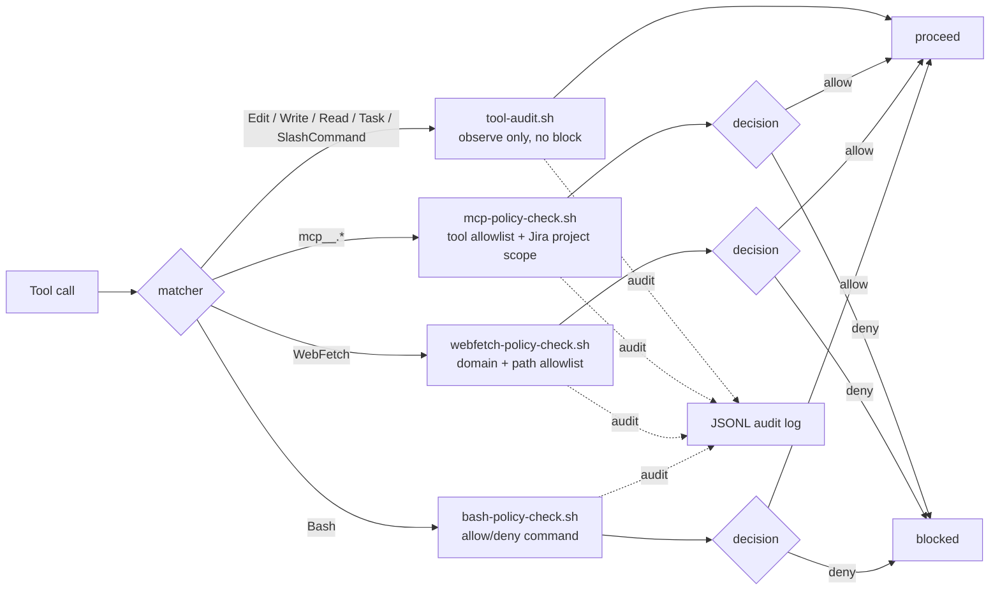
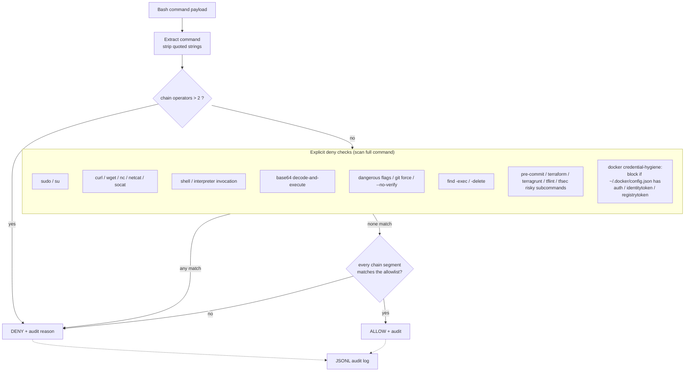
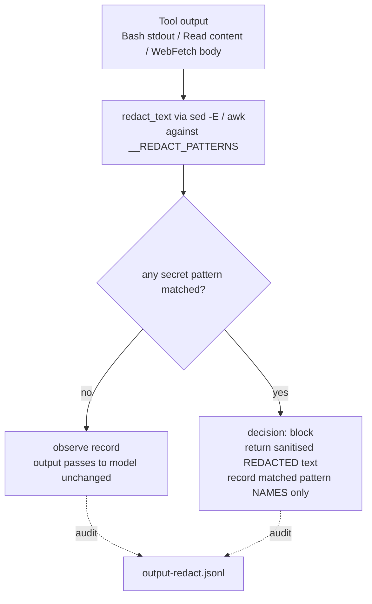
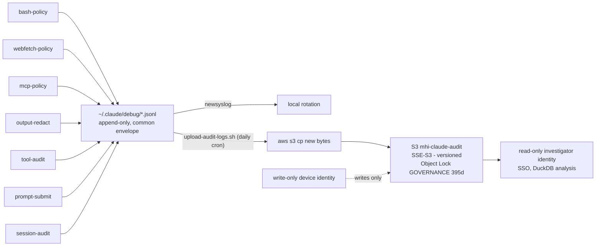

# Architecture and control flow

Visual overview of how the MHI Claude Code governance control pack works. These
diagrams describe the *installed* system (deployed to `/opt/claude/` and
`/Library/Application Support/ClaudeCode/` via MDM), grounded in
[`managed-settings.json`](../ClaudeCode/managed-settings.json) and the hooks under
[`ClaudeCode/opt/claude/hooks/`](../ClaudeCode/opt/claude/hooks/).

## 1. Layered architecture — where enforcement lives

Controls are cumulative and independent: a request must pass every layer that
applies to it. Settings alone are not the boundary — the hooks and the OS sandbox
are.

## 2. PreToolUse routing — which hook sees which tool

Each tool type is routed to exactly one dispatcher script by the `matcher` in
`managed-settings.json` (`hooks.PreToolUse`). There is one dispatcher per matcher.

## 3. Bash policy decision flow — order of checks

`bash-policy-check.sh` applies explicit deny checks first (these scan the whole
command string, so they still catch a bad token in any position), then a
default-deny allowlist evaluated per chain-segment. The explicit denies are what
stop the genuinely dangerous cases even for commands that spawn subprocesses.

> Note on the allowlist: it is evaluated per segment split on `&&`, `||`, `;`, `|`,
> and every segment (including the last) must match — a single non-allowlisted
> command is denied. Commands that *spawn* other programs (make, gradle, npx,
> `docker compose up`) are excluded from the allowlist because the hook cannot
> inspect what they spawn; see
> [`command-allowlist-risk-assessment.md`](command-allowlist-risk-assessment.md).

## 4. PostToolUse redaction flow — secrets never reach the model

`output-redact.sh` runs after Bash, Read, and WebFetch. It scans the tool output
against the pattern library in [`lib/redact.sh`](../ClaudeCode/opt/claude/hooks/lib/redact.sh)
and, if anything matches, blocks the raw output and returns a `[REDACTED]`
version instead — so the secret never enters the model's context window.

Patterns include AWS keys, GitHub PATs, `sk-`/Stripe/Slack tokens, JWTs, generic
`key=value` secrets, PEM blocks, connection strings, and the docker
`auth` / `identitytoken` / `registrytoken` config fields.

## 5. Audit pipeline — from hook to WORM store

Every hook (enforcing or observe-only) appends a single JSON Lines record via the
shared [`lib/audit-log.sh`](../ClaudeCode/opt/claude/hooks/lib/audit-log.sh)
helper. A daily root cron ships new bytes off-box; the bucket's Object Lock makes
records tamper-evident.

> Audit-trail limitation (recorded honestly for compliance): records are per
> top-level command. A subprocess-spawning tool logs one line and does not record
> what it spawned — the OS sandbox, not the audit log, is what contains those
> subprocesses.
